# 优先队列简介

## 什么是优先队列

**优先队列**（**priority queue**）是计算机科学中的一类抽象数据类型(Abstract Data Type)。优先队列中的每个元素都有各自的优先级，优先级最高的元素最先得到服务；优先级相同的元素按照其在优先队列中的顺序得到服务。优先队列通常使用"二叉堆"（binary heap）实现。二叉堆能保证树中最大的元素处在堆顶，这与优先队列要求优先级最高的元素排在队首相似，因此可以使用二叉堆来实现优先队列。

## 支持的操作

优先队列一般至少需要支持下述操作：

- 插入元素（push），时间复杂度：$O(\log n)$。
- 取出元素（pop），时间复杂度：$O(\log n)$。
- 查看元素（peek），时间复杂度：$O(1)$

其它可选的操作：

- 检查优先级高的一批元素
- 清空优先队列
- 批插入一批元素
- 合并多个优先队列
- 调整一个元素的优先级

## 特性

优先队列的实现常选用**二叉堆**(Binary Heap)，**在数据结构中，优先队列一般也是指堆**。

**堆的两个性质：**

1. **结构性**：堆是一颗除底层外被完全填满的二叉树，底层的节点从左到右填入，这样的树叫做**完全二叉树。**
2. **堆序性：**由于我们想很快找出最小元，则最小元素应该在根上，**任意节点都小于它的子节点**，这就是**小顶堆（Min-Heap）**；如果是查找最大元，则最大元素应该在根上，**任意节点都要大于它的子节点**，这就是**大顶堆(Max-Heap)。**

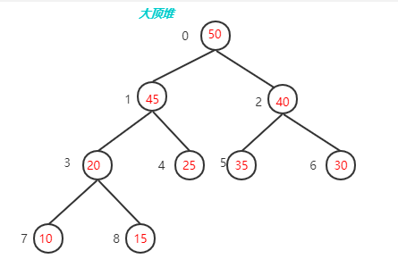

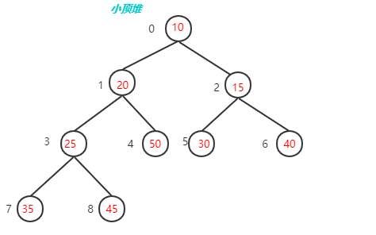

## 内存模型

二叉堆通常用数组来表示，因为一棵高度为 $h$ 的完全二叉树有 $2^h$ 到 $2^{(h+1)}-1$个节点，这样存放一个二叉堆就不会太浪费空间（不需要额外的指针），而且一旦知道高度，就可以知道节点数的范围。

我们使用层序遍历的方式将二叉树的节点存储在数组中，由于二叉堆是完全二叉树，所以可以将树型结构映射到线性数组空间之中且不产生空间浪费，反而因为不需要存储指针元素节省了空间。

但这样又如何索引其父节点与子节点呢（根节点的 $index$ 为0）？

假设一个节点 $index$ 为 $i$ ，则其：

- 左子节点：$2i + 1$

- 右子节点：$2i+2$
- 父节点：$(i-1)/2$

这个数组从逻辑上说就是一个堆结构，我们用公式重新描述堆的定义：

- 大顶堆：$arr[i] \geq arr[2i+1]$ && $arr[i] \geq arr[2i+2]$

- 小顶堆：$arr[i] \leq arr[2i+1]$ && $arr[i] \leq arr[2i+2]$

## 数据结构

```c
struct my_heap {
    int *data;		/* 元素存储地址 */
    int size;		/* 元素个数 */
    int capacity;	/* 容量 */
};
```

## 操作

下面以最大堆为例，使用图片简单介绍下它的基本操作，并附上C语言版的demo示例程序：

### 插入

最大堆的插入操作可以简单看成是“**结点上浮**”。当我们在向最大堆中插入一个结点我们必须满足完全二叉树的标准，那么被插入结点的位置的是固定的。而且要满足父结点关键字值不小于子结点关键字值，那么我们就需要去移动父结点和子结点的相互位置关系。如下图所示：

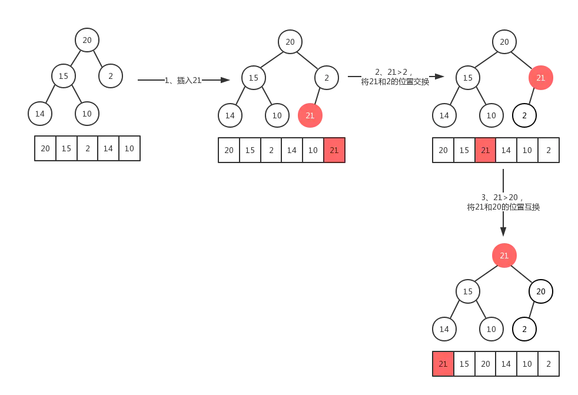

由于堆是一棵完全二叉树，存在 $n$ 个元素，那么他的高度为：$\log(n+1)$，这就说明代码中的`for`循环最多会执行 $O(\log n)$ 次。因此插入函数的时间复杂度为：$O(\log n)$。

```c
void shift_up(struct my_heap *heap, int index) {
    while (index > 0 && heap->data[index] > heap->data[(index - 1) / 2]) {
        swap(heap->data[index], heap->data[(index - 1) / 2]);
        index = (index - 1) / 2;
    }
    return;
}

bool push(struct my_heap *heap, int val) {
    if (heap->size == heap->capacity) {
        return false;
    }
    heap->data[heap->size] = val;
    heap->size++;
    shift_up(heap, heap->size - 1);
    return true;
}
```


### 删除

最大堆的删除操作，总是从堆的**根结点**删除元素。同样根元素被删除之后为了能够保证该树还是一个完全二叉树，我们需要来移动完全二叉树的最后一个结点，让其继续符合完全二叉树的定义，从这里可以看作是最大堆最后一个结点的**下沉**操作。如图：


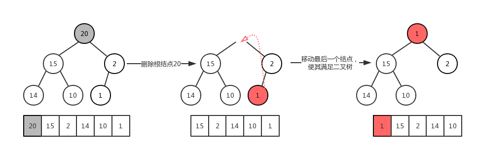

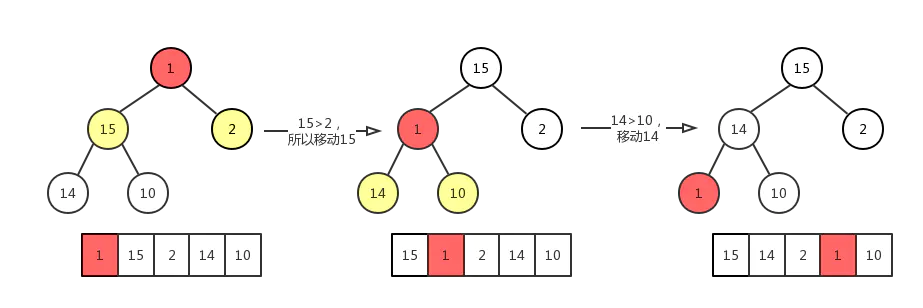

同最大堆的插入操作类似，同样包含 $n$ 个元素的最大堆，其高度为：$\log(n+1)$，其时间复杂度为：$O(\log n)$。

```c
void shift_down(struct my_heap *heap, int index) {
    int largest = index;
    int left = 2 * index + 1;
    int right = 2 * index + 2;

    if (left < heap->size && heap->data[left] > heap->data[largest]) {
        largest = left;
    }
    if (right < heap->size && heap->data[right] > heap->data[largest]) {
        largest = right;
    }
    if (largest != index) {
        swap(heap->data[index], heap->data[largest]);
        shift_down(heap, largest);
    }
}

bool pop(struct my_heap *heap, int *val) {
    if (heap->size == 0) {
        return false;
    }
    *val = heap->data[0];
    heap->data[0] = heap->data[heap->size - 1];
    heap->size--;
    shift_down(heap, 0);
    return true;
}
```


### 查找

查找就很简单了，因为是优先队列，考虑的是如何快速获取最优先的元素，而二叉堆中，最大/最小元素总是会自动调节到根的位置，所以我们只需要访问根元素即可。

```c
bool peek(struct my_heap *heap, int *val) {
    if (heap->size > 0) {
        *val = heap->data[0];
        return true;
    }
    return false;
}
```


### 创建

为什么要把最大堆的创建放在最后来讲？因为在堆的创建过程中，有两个方法。会分别用到最大堆的插入和最大堆的删除原理（上浮与下沉）：

1. 先创建一个**空堆**，然后根据元素一个一个去插入结点。由于插入操作的时间复杂度为$O(\log n)$，那么 $n$ 个元素插入进去，总的时间复杂度为 $O(n \log n)$。
2. 由于二叉堆以数组形式表 $n$ 个元素的一个完全二叉树，我们直接调整各个结点的位置来满足最大堆的特性即可，这个过程也叫**堆化**（Heapify），总的时间复杂度为 $O(n)$。

> 思考：为什么堆化的时间复杂度是 $O(n) $呢？

现在我们通过堆化的方式直接从数组创建一个最大堆，假设数组为`[79,66,43,83,30,87,38,55,91,72,49,9]`，其对应的完全二叉树如下图所示：


但是这明显不符合最大堆的定义，所以我们需要让该完全二叉树转换成最大堆！怎么转换成一个最大堆呢？
最大堆有一个特点就是其各个子树都是一个最大堆，那么我们就可以从把最小子树转换成一个最大堆，然后依次转换它的父节点对应的子树，直到最后的根节点所在的整个完全二叉树变成最大堆。

从最后一个非叶子结点开始**从下往上**调整，然后依次去找倒数第二个，倒数第三个非叶子节点…

最后一个非叶子节点其实就是最后一个叶子节点的父节点：如果元素个数为 $n$ ，则最后一个非叶子节点的`index`为$n / 2 - 1$。

这个调整过程，我们会使用到节点删除操作中的**下沉**动作。过程如下图：

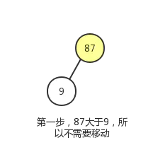

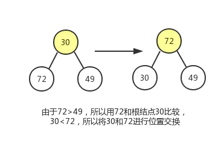

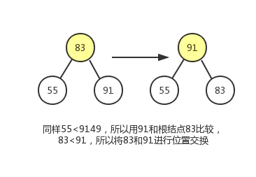

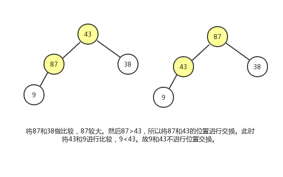

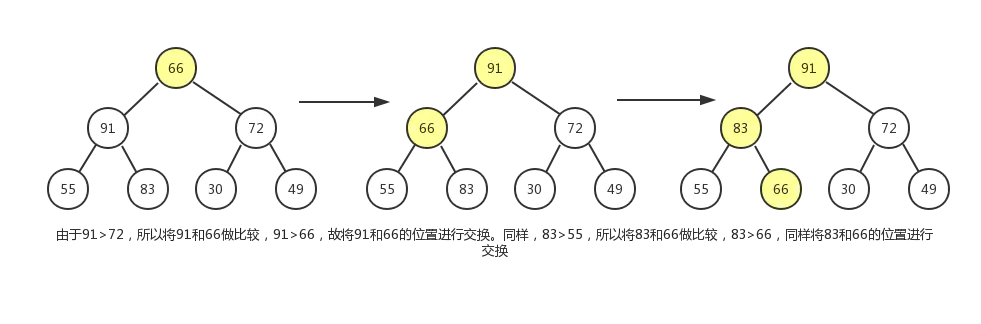

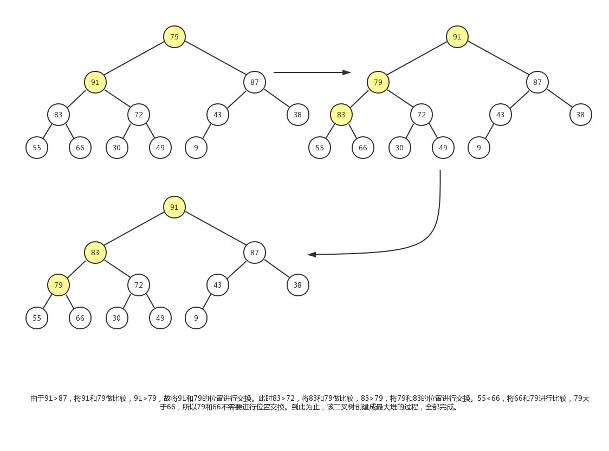

最终结果如下：

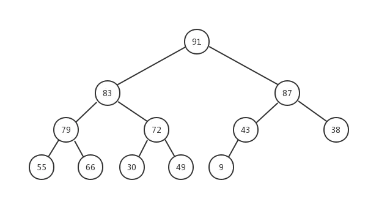

```c
void heapify(struct my_heap *heap) {
    for (int i = heap->size / 2 - 1; i >= 0; i--) {
        shift_down(heap, i);
    }
    return;
}
```


## 堆排序

堆排序底层使用的也是二叉堆，在之前基础上扩展下，看看堆排序是如何做的。

- 升序 --> 使用大顶堆

- 降序 --> 使用小顶堆

步骤：

1. 先$n$个元素的无序序列，构建成大顶堆

2. 将根节点与最后一个元素交换位置

3. 交换过后可能不再满足大顶堆的条件，将堆顶**下沉**，重新构建成大顶堆

4. 重复第二步、第三步直到整个数组排序完成

我们使用如下数据为例，图解排序过程：

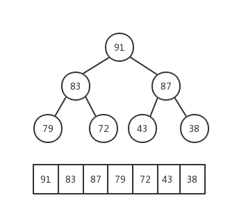


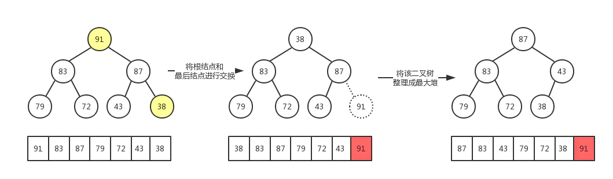


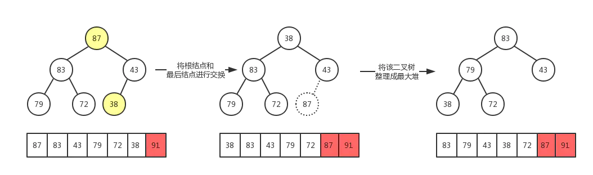


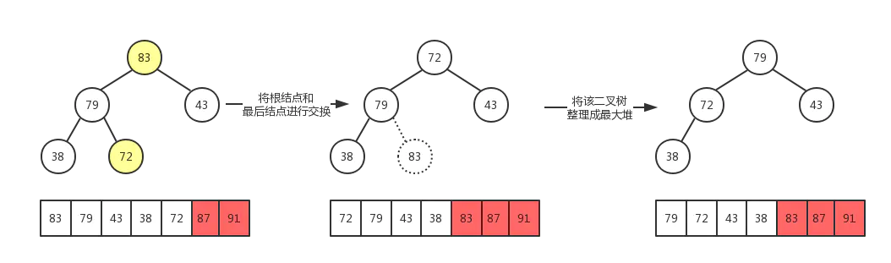

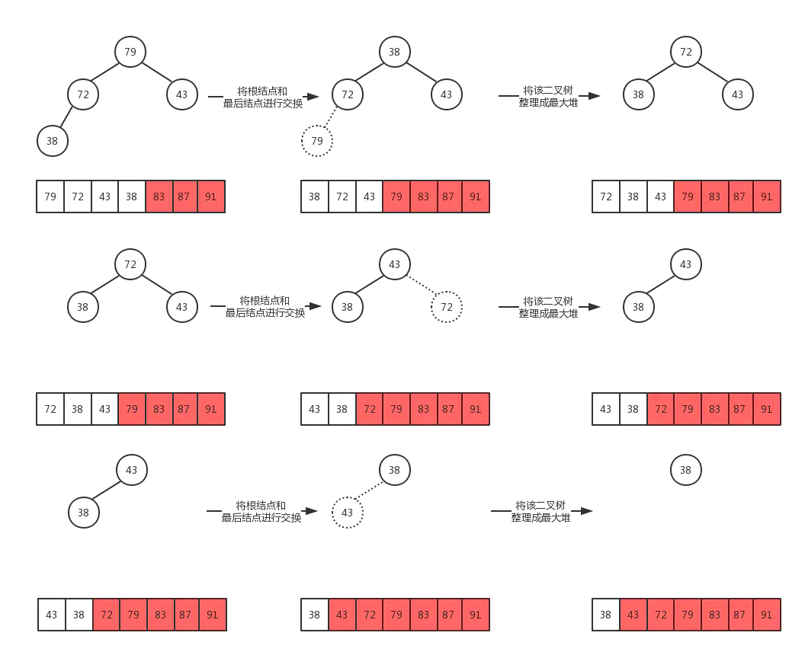

最后，数组被成功排序，示例demo：


```c
void heap_sort(struct my_heap *heap) {
    heapify(heap);
    for (int i = heap->size - 1; i > 0; i--) {
        swap(heap->data[i], heap->data[0]);
        heap->size--;
        shift_down(heap, 0);
    }
}
```

堆排序是一种选择排序，整体主要由构建初始堆，交换堆顶元素和末尾元素并重建堆两部分组成。其中构建初始堆经推导复杂度为$O(n)$，在交换并重建堆的过程中，需交换$n-1$次，而重建堆的过程中，根据完全二叉树的性质，$[\log(n-1),\log (n-2), \cdots, 1]$逐步递减，近似为$n \log n$。所以堆排序时间复杂度一般认为就是$O(n \ log n)$。

