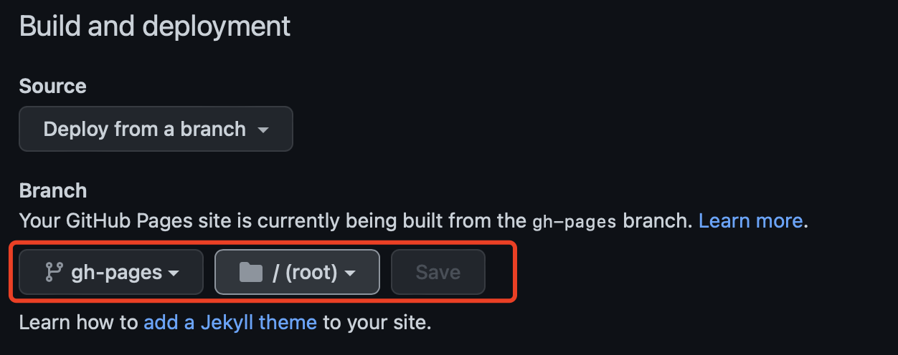

## 简介

关注内容，不花哨，不折腾。

可以像写书一样成体系，分章节。

渲染为网页展示的同时，也要对源码进行管理。

## 思路

使用 **[mdbook](https://mirrors.gitcode.host/chinanf-boy/mdBook-zh/format/summary.zh.html)** + **[github pages](https://docs.github.com/zh/pages/getting-started-with-github-pages/about-github-pages)**

repo的`main`分支用于书籍源码管理，`gh-pages`分支为生成的网页。

在github上创建用户站点，做为博客入口，展示并链接其它项目站点的文章。

另创建其它项目站点，用于写一些专题，可在用户站点的首页进行引导。

## github actions

在仓库中添加`.github/workflows`目录，则github会在其中查找`*.yml`文件自动处理CI/CD。

这里我们添加个`ci.yml`文件，内容如下：

```yml
name: GitHub Pages
on:
    push:
        branches:
            - main
    pull_request:
jobs:
    deploy:
        runs-on: ubuntu-latest
        permissions:
            contents: write
        concurrency:
            group: ${{ github.workflow }}-${{ github.ref }}
        steps:
            - uses: actions/checkout@v3

            - name: Setup mdBook
              uses: peaceiris/actions-mdbook@v1
              with:
                  mdbook-version: "latest"
                  # mdbook-version: "0.4.8"

            - run: mdbook build

            - name: Deploy
              uses: peaceiris/actions-gh-pages@v3
              if: ${{ github.ref == 'refs/heads/main' }}
              with:
                  github_token: ${{ secrets.GITHUB_TOKEN }}
                  publish_dir: ./book
```

则每次对`main`分支进行提交时，自动把书籍`build`到`gh-pages`分支下。

注意的是，如果有私有域名，在**用户站点**的配置中添加`cname`的选项：

```yml
- name: Deploy
	uses: peaceiris/actions-gh-pages@v3
	if: ${{ github.ref == 'refs/heads/main' }}
		with:
		github_token: ${{ secrets.GITHUB_TOKEN }}
		publish_dir: ./book
		# 仅在用户站点下添加下面的配置
		cname: blog.tabliu.top
```

更多设置参考[这里](https://github.com/peaceiris/actions-gh-pages#%EF%B8%8F-mdbook-rust)

## 设置

在github仓库中找到**Settings->Pages**, 选择站点使用的分支与路径，由于上面默认生成站点到`gh-pages`分支，这里选择`gh-pages`分支的根目录并保存。


